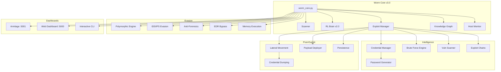
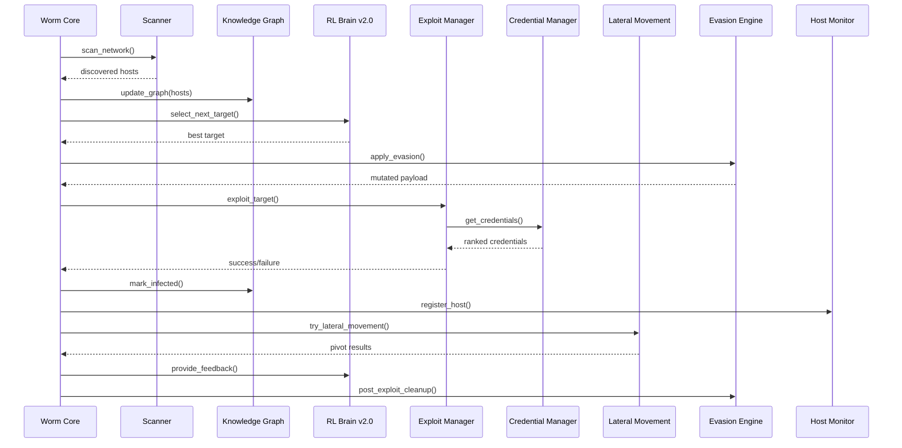
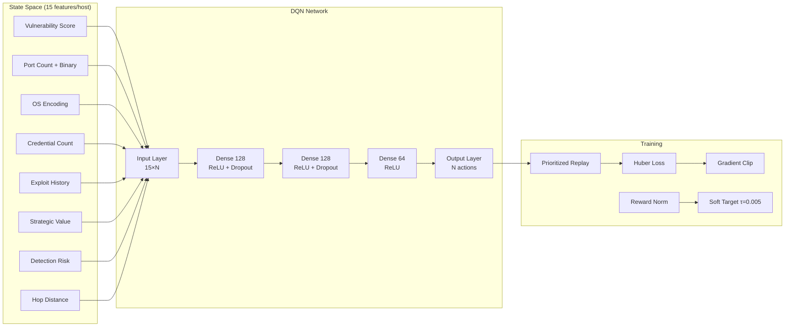

<p align="center">
  <h1 align="center">🐛 Wormy — ML Network Worm v3.0</h1>
  <p align="center">
    <strong>ML-Driven Autonomous Network Propagation Platform</strong>
  </p>
  <p align="center">
    <a href="https://github.com/Ruby570bocadito/Wormy-ML-Network-Worm"></a>
    <a href="https://github.com/Ruby570bocadito/Wormy-ML-Network-Worm"></a>
    <a href="https://github.com/Ruby570bocadito/Wormy-ML-Network-Worm"></a>
    <a href="https://github.com/Ruby570bocadito/Wormy-ML-Network-Worm"></a>
  </p>
  <p align="center">
    <strong>Developed by <a href="https://github.com/Ruby570bocadito">Ruby570bocadito</a></strong>
  </p>
</p>

---

> **⚠️ EDUCATIONAL & AUDIT PURPOSE ONLY** — Only use on systems you own or have explicit written authorization for. Unauthorized access is illegal.

---

## Table of Contents

- [Overview](#overview)
- [Features](#features)
- [Quick Start](#quick-start)
- [Web Dashboards](#web-dashboards)
- [Interactive CLI](#interactive-cli)
- [Architecture](#architecture)
- [The ML Brain](#the-ml-brain)
- [Exploit Modules](#exploit-modules)
- [Credential Intelligence](#credential-intelligence)
- [Evasion Engine](#evasion-engine)
- [Configuration Profiles](#configuration-profiles)
- [Docker Lab](#docker-lab)
- [Training](#training)
- [API Reference](#api-reference)
- [Project Structure](#project-structure)
- [Requirements](#requirements)
- [License](#license)

---

## Overview

Wormy is an intelligent network propagation research platform that uses **Deep Q-Learning (DQN)** to autonomously discover, exploit, and propagate across networks. It combines machine learning with real exploit execution, credential intelligence, lateral movement techniques, and advanced evasion capabilities.

**What makes Wormy unique:**
- 🧠 **Self-training RL agent** that learns optimal attack paths
- 🔑 **Intelligent credential ranking** using UCB1 bandit algorithms
- 🗺️ **Visual network mapping** with Armitage-style dashboard
- 🛡️ **Adaptive evasion** that adjusts to detection risk
- 🔄 **Self-healing** that repairs compromised components
- 📊 **Real-time monitoring** with web and CLI dashboards

---

## Features

### Core Capabilities

| Feature | Description |
|---------|-------------|
| **RL Brain (DQN)** | Deep Q-Learning agent with 15 features/host, shaped rewards, curriculum learning, and online learning during operation |
| **26 Real Exploits** | SMB, SSH, Web, MySQL, PostgreSQL, MongoDB, Redis, FTP, Telnet, VNC, SNMP, RDP, Docker, Kubernetes, MSSQL, Jenkins, Tomcat, Log4j, Struts, WebLogic, Elasticsearch, and more |
| **Credential Intelligence** | UCB1 bandit ranking, password mutation engine, password spraying with lockout detection, credential pivoting |
| **Lateral Movement** | SSH pivot, Pass-the-Hash, PSExec, WMI, RDP, WinRM |
| **Knowledge Graph** | Host/service/credential tracking with BFS path finding |
| **Host Monitor** | Per-host metrics, unique payload mutation, health monitoring, self-healing |
| **Evasion** | IDS/IPS evasion, Anti-Forensics, EDR Bypass, Memory Execution, Polymorphic Engine (5 levels) |
| **C2 Server** | Multi-protocol (HTTPS, DNS, ICMP, WebSockets, SMB) with DGA |
| **Web Dashboards** | Armitage-style visual map + professional stats dashboard |
| **Interactive CLI** | 27 commands for full control |
| **Audit Reports** | JSON, CSV, Text, PDF with topology visualization |

### Statistics

| Metric | Value |
|--------|-------|
| **Python files** | 118 |
| **Lines of code** | 36,000+ |
| **Exploit modules** | 26 (all real, zero simulation) |
| **Wordlist entries** | 1,737+ |
| **Training scenarios** | 5 realistic |
| **CLI commands** | 27 |
| **Web dashboards** | 2 |
| **Evasion techniques** | 20+ |
| **Tests** | 32/32 passing |

---

## Quick Start

### Installation

```bash
# Clone the repository
git clone https://github.com/Ruby570bocadito/Wormy-ML-Network-Worm.git
cd Wormy-ML-Network-Worm

# Create virtual environment
python3 -m venv venv
source venv/bin/activate

# Install dependencies
pip install -r requirements.txt
```

### Basic Usage

```bash
# Interactive mode with full CLI (recommended)
python3 worm_core.py --dry-run --interactive

# Dry run — safe simulation, no real exploits
python3 worm_core.py --dry-run --profile audit

# Stealth profile — slow, careful, with evasion
python3 worm_core.py --profile stealth

# Aggressive profile — fast, maximum spread
python3 worm_core.py --profile aggressive

# Scan only — discover hosts without exploiting
python3 worm_core.py --scan-only

# With Metasploit — real exploits via RPC
python3 worm_core.py --config configs/config_msf.yaml

# Kill switch — emergency stop
python3 worm_core.py --kill-switch "EMERGENCY_STOP_2024"
```

### Command Line Arguments

| Argument | Description |
|----------|-------------|
| `--config <file>` | Configuration file to use |
| `--scan-only` | Scan network and exit |
| `--kill-switch <code>` | Activate kill switch |
| `--profile <name>` | Configuration profile: `stealth`, `aggressive`, `audit` |
| `--dry-run` | Simulate without executing real exploits |
| `--no-monitor` | Disable CLI monitor |
| `--interactive` | Interactive CLI mode |

---

## Web Dashboards

When Wormy starts, two web dashboards are automatically launched:

### Armitage Dashboard — http://localhost:5001

Visual network map inspired by Metasploit's Armitage GUI:

- **Network Map**: Host icons with color-coded status (green=infected, red=failed, blue=discovered)
- **Training Panel**: Scenario selection, progress tracking, start/stop training
- **Statistics**: Real-time counts of infected, discovered, failed hosts
- **Activity Feed**: Live event log with timestamps
- **Context Menu**: Right-click on hosts to Exploit, Scan, view Vulnerabilities
- **Auto-refresh**: Updates every 3 seconds

### Web Dashboard — http://localhost:5000

Professional monitoring dashboard:

- **8 Stat Cards**: Infected, Discovered, Vulnerabilities, Exploit Chains, Lateral Movement, Credentials, C2 Beacons, Polymorphic Mutations
- **Hosts Table**: IP, OS, Status, Health, Payload variant
- **Vulnerabilities Table**: Host, Name, Severity, CVSS score
- **Activity Feed**: Real-time event log
- **8 REST API Endpoints**: `/api/status`, `/api/hosts`, `/api/activity`, `/api/vulnerabilities`, `/api/credentials`, `/api/topology`, `/api/stats`, `/api/command`

### Accessing Dashboards

| Location | URL |
|----------|-----|
| **Same machine** | http://localhost:5001 (Armitage) / http://localhost:5000 (Web) |
| **Same network** | http://192.168.1.141:5001 / http://192.168.1.141:5000 |
| **Remote** | http://<your-ip>:5001 / http://<your-ip>:5000 |

---

## Interactive CLI

Start with `python3 worm_core.py --dry-run --interactive`

### Scan & Discovery

| Command | Description |
|---------|-------------|
| `scan [professional\|basic]` | Scan the network with visual progress bar |
| `targets` | List all discovered hosts |
| `vulns <ip>` | Show vulnerabilities for a target |
| `topo` | Generate network topology visualization |

### Exploitation

| Command | Description |
|---------|-------------|
| `exploit <ip>` | Exploit a specific target |
| `chain <ip>` | Show exploit chain for a target |
| `bruteforce <ip> [service]` | Brute force credentials |
| `deploy <ip> [type]` | Deploy payload (reverse_shell, beacon, webshell) |
| `exec <ip> <command>` | Execute command on infected host |
| `persist <ip> [methods]` | Establish persistence |

### Lateral Movement

| Command | Description |
|---------|-------------|
| `pivot <source_ip>` | Show lateral movement options |

### Monitoring

| Command | Description |
|---------|-------------|
| `status` | Current propagation status |
| `hosts` | Host monitoring dashboard |
| `monitor` | Real-time host monitoring |
| `host <ip>` | Detailed info for a specific host |
| `activity [limit]` | Real-time activity feed |
| `evasion` | Show evasion status and statistics |

### Credentials

| Command | Description |
|---------|-------------|
| `creds` | Show discovered credentials |

### Learning

| Command | Description |
|---------|-------------|
| `graph` | Knowledge graph summary |
| `propagation_map` | Show how infection spread |
| `heal <ip>` | Trigger self-healing on a host |

### Execution

| Command | Description |
|---------|-------------|
| `run [iterations]` | Start propagation for N iterations |
| `stop` | Stop propagation |
| `report` | Generate full audit report |

---

## Architecture

### System Overview



### Propagation Flow



### RL Brain Architecture



---

## The ML Brain

### How It Works

Wormy uses **Deep Q-Learning (DQN)** to make intelligent decisions about which hosts to attack.

**State Space (15 features per host):**
- Vulnerability score (0-100)
- Open port count
- OS encoding (one-hot: Windows/Linux/Network Device)
- Port binary vector (top 20 ports)
- Credential count available for this host
- Previous exploit attempts
- Previous exploit success rate
- Strategic value (high-value target flag)
- Detection risk score
- Hop distance from origin
- And more...

**Action Space:**
- Choose which host to attack next from available targets

**Reward Function:**
| Event | Reward |
|-------|--------|
| Successful infection | +20 |
| High-value target infected | +15 |
| Credential discovered | +3 |
| Failed exploit | -5 |
| Detection event | -10 |
| Per step penalty | -0.5 |

**Learning Algorithm:**
- Experience replay with prioritized sampling
- Soft target network updates (τ=0.005)
- Epsilon-greedy exploration with decay
- Online learning during operation

### Training Scenarios

| Scenario | Hosts | Description |
|----------|-------|-------------|
| **Small Office** | 10 | Router, file server, 5 workstations, printer, WiFi AP |
| **Enterprise** | 30 | AD domain, DCs, servers, workstations, DMZ, management |
| **Datacenter** | 50 | Web farms, DB clusters, containers, storage, monitoring |
| **Cloud** | 40 | API gateway, microservices, K8s, managed DBs, CI/CD |
| **IoT/OT** | 25 | SCADA, PLCs, cameras, building automation, sensors |

### Training Commands

```bash
# Train on all scenarios (curriculum order)
python3 training/realistic_training.py

# Train on specific scenarios
python3 training/realistic_training.py --scenarios small_office enterprise

# List available scenarios
python3 training/realistic_training.py --list-scenarios

# Check training status
python3 training/realistic_training.py --status

# Train with custom episodes
python3 training/realistic_training.py --episodes 500
```

---

## Exploit Modules

All 26 exploit modules use **real protocol implementations** — zero simulation.

### Network Services

| Module | Protocol | Library | Technique |
|--------|----------|---------|-----------|
| **SMB** | 445/139 | impacket | Null session, auth, Pass-the-Hash |
| **SSH** | 22 | paramiko | Brute force, key auth |
| **FTP** | 21 | ftplib | Anonymous, brute force |
| **Telnet** | 23 | telnetlib | Brute force |
| **VNC** | 5900-5903 | DES crypto | No-auth, DES brute force |
| **SNMP** | 161 | raw UDP | Community string brute force |
| **RDP** | 3389 | xfreerdp | Auth verification |

### Databases

| Module | Protocol | Library | Technique |
|--------|----------|---------|-----------|
| **MySQL** | 3306 | mysql.connector | Auth brute force |
| **PostgreSQL** | 5432 | psycopg2 | Auth brute force |
| **MongoDB** | 27017 | pymongo / raw BSON | No-auth, auth |
| **Redis** | 6379 | raw RESP | No-auth, auth |
| **MSSQL** | 1433 | pymssql / pyodbc | Auth, xp_cmdshell |

### Web Applications

| Module | Protocol | Library | Technique |
|--------|----------|---------|-----------|
| **Web** | 80/443/8080 | requests | Login, SQLi, cmd injection, web shells |
| **Jenkins** | 8080 | requests | Script console RCE |
| **Tomcat** | 8080 | requests | Manager default creds, WAR deploy |
| **Log4j** | 8080 | requests | CVE-2021-44228 |
| **Struts** | 8080 | requests | CVE-2017-5638 |
| **WebLogic** | 7001 | requests | Deserialization RCE |

### Infrastructure

| Module | Protocol | Library | Technique |
|--------|----------|---------|-----------|
| **Docker** | 2375 | requests | API exposed RCE |
| **Kubernetes** | 6443 | requests | API enumeration |
| **Elasticsearch** | 9200 | requests | Script injection RCE |

### Metasploit Integration

When Metasploit RPC is configured, Wormy can execute **25 additional exploits** through msfrpcd:
- EternalBlue (MS17-010), BlueKeep, Zerologon, NoPAC
- And all the web/database exploits above via Metasploit modules

---

## Credential Intelligence

### Password Generator

Generates contextual passwords based on:
- **Username patterns**: admin, root, service names
- **Leet speak**: admin→@dmin, password→p@ssw0rd
- **Year appending**: admin2024, admin2025, admin2026
- **Common patterns**: Password1!, Welcome123, Company2024!
- **Keyboard patterns**: qwerty123, asdfgh, 1q2w3e4r

### UCB1 Bandit Ranking

Each credential is scored using the **Upper Confidence Bound** algorithm:
```
score = success_rate + √(2 × ln(total_attempts) / credential_attempts)
```

This balances **exploitation** (using known-good credentials) with **exploration** (trying new ones).

### Password Spraying

- One password across many targets
- Lockout detection with exponential backoff
- Automatic cooldown after 5 failures (5 minutes)

### Credential Pivoting

- Credentials discovered on one host are automatically tried on all others
- Cross-service reuse: SSH creds → SMB → FTP → MySQL → etc.

### Wordlists

| File | Entries | Content |
|------|---------|---------|
| `passwords.txt` | 762 | Common passwords, patterns, seasonal |
| `usernames.txt` | 639 | Default accounts, services, CI/CD |
| `ssh_creds.txt` | 180 | SSH-specific credentials |
| `smb_creds.txt` | 35 | Windows/SMB credentials |
| `db_creds.txt` | 37 | Database credentials |
| `web_creds.txt` | 47 | Web app credentials |
| `common_creds.txt` | 95 | Most common username:password pairs |

---

## Evasion Engine

### IDS/IPS Evasion

| Technique | Description |
|-----------|-------------|
| **Signature Avoidance** | Detects and obfuscates known IDS signatures (Snort, Suricata) |
| **Packet Fragmentation** | Splits payloads into small chunks (<64 bytes) |
| **Traffic Encryption** | XOR-based encryption with rotating keys |
| **Timing Randomization** | Adaptive jitter based on detection risk |
| **Decoy Generation** | Creates fake web, DNS, SMTP, ICMP traffic |
| **Protocol Mimicry** | Wraps malicious data in legitimate HTTP/DNS/SMTP |
| **Domain Fronting** | Hides C2 traffic behind legitimate CDNs |

### Anti-Forensics

- Event log clearing (Windows)
- Linux log clearing (/var/log, journalctl)
- Shell history clearing
- Secure file deletion
- Timestamp manipulation

### EDR Bypass

- EDR detection (checks for running processes)
- AMSI bypass (Windows)
- PPID spoofing
- Process hollowing
- Thread hijacking
- Direct syscalls

### Memory Execution

- Shellcode execution (Linux/Windows)
- PE from memory
- PowerShell in-memory
- Python bytecode execution
- Reflective DLL injection

### Polymorphic Engine

5 mutation levels:
1. Variable name randomization
2. Dead code insertion + string encoding
3. Control flow flattening + NOP equivalents
4. Network signature mutation
5. Full payload transformation

---

## Configuration Profiles

| Setting | stealth | aggressive | audit |
|---------|---------|------------|-------|
| Propagation delay | 10s | 0.5s | 3s |
| Max infections | 10 | 100 | 50 |
| Stealth mode | ✅ | ❌ | ✅ |
| IDS detection | ✅ | ❌ | ✅ |
| Honeypot detection | ✅ | ❌ | ✅ |
| Max runtime | 8h | 2h | 4h |
| Pretrained model | ✅ | ❌ | ✅ |

---

## Docker Lab

A safe, isolated testing environment with 12 vulnerable services:

```bash
# Start the lab
cd docker-lab && docker-compose up -d

# Services available:
# Metasploitable2  → 172.20.0.100 (all ports vulnerable)
# DVWA             → 172.20.0.10  (port 8080)
# WebGoat          → 172.20.0.11  (port 8081)
# MySQL            → 172.20.0.20  (root:root)
# PostgreSQL       → 172.20.0.21  (postgres:postgres)
# MongoDB          → 172.20.0.22  (no auth)
# Redis            → 172.20.0.23  (no auth)
# Elasticsearch    → 172.20.0.24  (no security)
# FTP              → 172.20.0.30  (ftpuser:ftpuser)
# SSH              → 172.20.0.31  (admin:password)

# Test against the lab
python3 worm_core.py --interactive --config configs/config_test.yaml

# Stop the lab
cd docker-lab && docker-compose down
```

---

## API Reference

### REST API Endpoints

| Endpoint | Method | Description |
|----------|--------|-------------|
| `/api/status` | GET | Current worm status |
| `/api/hosts` | GET | List of discovered/infected hosts |
| `/api/activity` | GET | Activity feed (limit=N) |
| `/api/vulnerabilities` | GET | Discovered vulnerabilities |
| `/api/credentials` | GET | Discovered credentials |
| `/api/topology` | GET | Network topology data |
| `/api/stats` | GET | Full statistics |
| `/api/command` | POST | Send command to host |

---

## Project Structure

```
Wormy-ML-Network-Worm/
├── worm_core.py                    # Main orchestrator v3.0
├── configs/                        # Configuration files
│   ├── config.py                   # Config parser
│   ├── config.yaml                 # Default config
│   ├── config_msf.yaml             # Metasploit config
│   └── config_*.yaml               # Profile configs
├── exploits/                       # Exploitation engine
│   ├── exploit_manager.py          # Exploit orchestrator
│   ├── credential_manager.py       # Credential intelligence
│   ├── brute_force_engine.py       # Brute force engine
│   ├── exploit_engine.py           # Vuln scanner + exploit chains
│   ├── metasploit_client.py        # Metasploit RPC client
│   ├── async_exploit.py            # Async exploit dispatcher
│   └── modules/                    # 26 exploit modules
│       ├── smb_exploit.py
│       ├── ssh_exploit.py
│       ├── web_exploit.py
│       └── ... (23 more)
├── scanner/                        # Network scanning
│   ├── __init__.py                 # IntelligentScanner
│   ├── professional_scanner.py     # Professional scanner
│   ├── nmap_scanner.py             # Nmap integration
│   └── async_scanner.py            # Async scanner
├── rl_engine/                      # Machine learning
│   └── __init__.py                 # DQN agent + environment
├── training/                       # Training system
│   ├── realistic_training.py       # Realistic training engine
│   └── scenarios.py                # 5 training scenarios
├── evasion/                        # Evasion techniques
│   ├── ids_evasion.py              # IDS/IPS evasion
│   ├── anti_forensics.py           # Anti-forensics
│   ├── edr_bypass.py               # EDR bypass
│   ├── memory_execution.py         # Memory execution
│   ├── polymorphic_engine.py       # Polymorphic engine
│   ├── ids_detector.py             # IDS detection
│   └── stealth_engine.py           # Stealth engine
├── post_exploit/                   # Post-exploitation
│   ├── lateral_movement.py         # Lateral movement engine
│   ├── persistence_engine.py       # Persistence engine
│   ├── payload_deployer.py         # Payload deployment
│   ├── credential_dumping.py       # Credential dumping
│   └── privilege_escalation.py     # Privilege escalation
├── c2/                             # Command & Control
│   ├── multi_protocol_c2.py        # Multi-protocol C2
│   ├── server.py                   # C2 server
│   ├── client.py                   # C2 client
│   └── dga.py                      # Domain Generation Algorithm
├── monitoring/                     # Monitoring & dashboards
│   ├── armitage_dashboard.py       # Armitage-style dashboard
│   ├── web_dashboard.py            # Web dashboard
│   ├── cli_monitor.py              # CLI monitor
│   └── host_monitor.py             # Host monitor
├── core/                           # Core components
│   ├── knowledge_graph.py          # Knowledge graph
│   └── self_healing.py             # Self-healing
├── utils/                          # Utilities
│   ├── logger.py                   # Logging system
│   ├── validators.py               # Input validation
│   ├── rate_limiter.py             # Rate limiting
│   ├── audit_report.py             # Audit reports
│   ├── pdf_report.py               # PDF reports
│   └── topology_visualizer.py      # Topology visualization
├── wordlists/                      # Credential wordlists
│   ├── passwords.txt               # 762 passwords
│   ├── usernames.txt               # 639 usernames
│   └── *_creds.txt                 # Per-service credentials
├── docker-lab/                     # Docker testing lab
│   └── docker-compose.yml
├── scripts/                        # Utility scripts
│   ├── setup_metasploit.sh         # Metasploit setup
│   └── test_docker_lab.sh          # Docker lab test
├── tests/                          # Test suite
│   └── test_*.py
└── README.md                       # This file
```

---

## Requirements

### Python 3.8+

```
scapy>=2.5.0
python-nmap>=0.7.1
impacket>=0.11.0
paramiko>=3.4.0
requests>=2.31.0
urllib3>=2.0.0
msgpack>=1.0.0
flask>=3.0.0
colorama>=0.4.6
torch>=2.0.0
gymnasium>=0.29.0
numpy>=1.24.0
scikit-learn>=1.3.0
```

### Optional Dependencies

| Package | Feature |
|---------|---------|
| `pymssql` | MSSQL exploitation |
| `pyodbc` | MSSQL exploitation |
| `mysql-connector-python` | MySQL exploitation |
| `psycopg2` | PostgreSQL exploitation |
| `pymongo` | MongoDB exploitation |
| `pycryptodome` | VNC DES encryption |
| `pyvis` | Interactive topology maps |
| `graphviz` | Static topology maps |
| `reportlab` | PDF report generation |

---

## License

**MIT License** — Copyright (c) 2024 Ruby570bocadito

See [LICENSE](LICENSE) and [NOTICE](NOTICE) files.

All source files include copyright headers attributing the original author.

---

## Ethical Notice

**Only use on systems you own or have explicit written authorization for.** Unauthorized access is illegal.

This tool is designed for:
- ✅ Authorized security assessments
- ✅ Red team exercises
- ✅ Educational purposes
- ✅ Research

It is NOT designed for:
- ❌ Unauthorized access
- ❌ Malicious activity
- ❌ Any illegal purpose

---

<p align="center">
  <strong>🐛 Wormy ML Network Worm v3.0</strong><br>
  <strong>Developed by <a href="https://github.com/Ruby570bocadito">Ruby570bocadito</a></strong>
</p>
